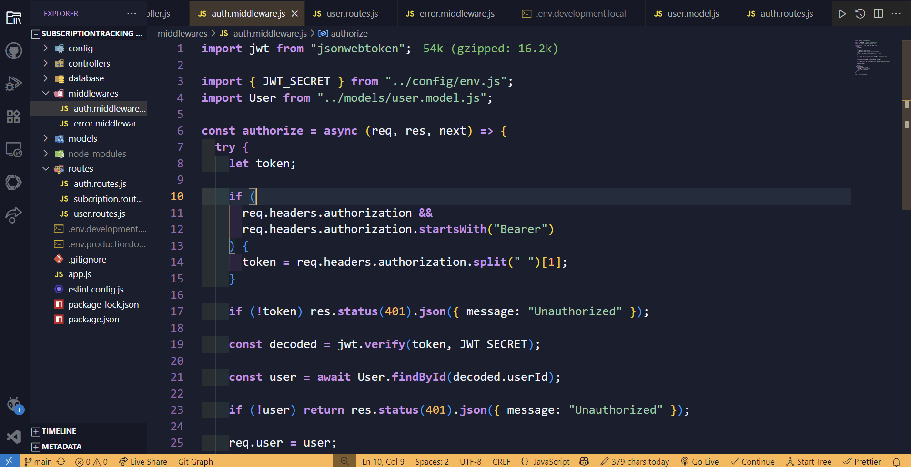
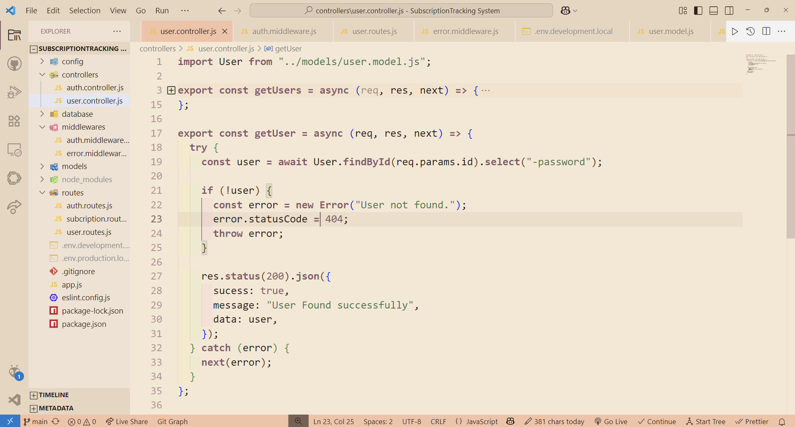

# GhibliGlow Theme 🌟

A Visual Studio Code theme inspired by Studio Ghibli's aesthetic, offering both light and dark variants.

## Preview

### Dark Theme



### Light Theme



## Installation

1. Open **Extensions** sidebar panel in VS Code. `View → Extensions`
2. Search for `GhibliGlow`
3. Click **Install**
4. Click **Reload** to reload your editor
5. Code > Preferences > Color Theme > **Ghibli Light** or **Ghibli Dark**

## Features

- Light and Dark theme variants
- Carefully chosen colors inspired by Studio Ghibli's color palette
- Enhanced readability for long coding sessions
- Semantic highlighting support
- Special attention to syntax highlighting for:
  - JavaScript/TypeScript
  - HTML/CSS
  - Python
  - And more...

## Color Palette

| Color           | Hex Code  | Usage                  |
| --------------- | --------- | ---------------------- |
| Background Dark | `#1A1E2E` | Editor background      |
| Foreground      | `#F0F4F8` | Main text              |
| Accent          | `#FFB74D` | Highlights and accents |
| Purple          | `#C792EA` | Keywords and functions |
| Green           | `#9CCEA9` | Strings and attributes |

## Customization

You can customize the theme further by adding these settings to your `settings.json`:

```json
{
  "workbench.colorCustomizations": {
    "[Ghibli Light]": {
      // Your custom overrides for light theme
    },
    "[Ghibli Dark]": {
      // Your custom overrides for dark theme
    }
  }
}
```

## Contributing

If you'd like to contribute to this theme, please:

1. Fork the repository
2. Create a new branch for your changes
3. Submit a pull request

## Issues

Found a bug or have a suggestion? Please file an issue on the GitHub repository.

## License

This theme is released under the [MIT License](LICENSE).

## Author

Created by [Tanbir Alam](https://github.com/yourusername)

---

**Enjoy!** ✨
